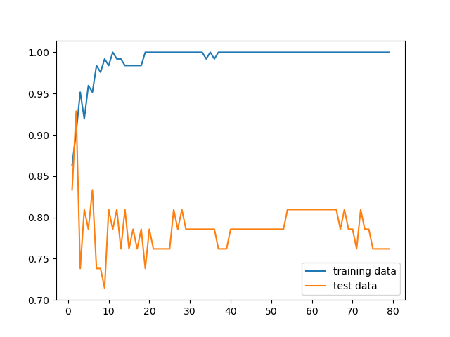

# Suicide risk prevention II (Random forest approach)
### Exercise 2 from Machine Learning for Data Analysis

## Introduction

In the past week we tried to improve the suicide risk detection using a decision tree. The article could be found in this git
repository here: [Suicide risk prevention I](https://github.com/Duxy1996/ML-modules/tree/master/W1). The results given were optimistic,
we could know in which city/zone it is probably to have the suicide problem. The accuracy of the classifier was **90%** for the test
data.

The parameters used to found this result where: **income, emplyment rate and alcohol consumption**.

## Problem:
The suicide rate is raising in many countries which the problem seemed to be controlled. The main factors of this case are not
well known yet, and this fact is dangerous because we cannot do anything without knowing the problem.

In countries such us United Kindom and EEUU suicides are rising and, now the average is over the 15 people over 100.000 people which
is worrying.

We want to use decision trees to predict in which zones this rate can raise. Using the **GapMinder** dataset we will discover which
zones are over the 15 per 100.000 of suicide rate. Knowing this information wee could make a first approach to the problem and help the
people which is in the risk group.

## Dataset:
**GapMinder** is a good reference to get data from several countries and make a study to detect people which is in the suicide risk group and help with its problems before one fatality could appear. This dataset has information about different features and targets
which are used to measure the prosperity of one country.

The features in this dataset are:

* 0 country
* 1 incomeperperson
* 2 alcconsumption
* 3 armedforcesrate
* 4 breastcancerper100th
* 5 co2emissions
* 6 femaleemployrate
* 7 hivrate
* 8 internetuserate
* 9 lifeexpectancy
* 10 oilperperson
* 11 polityscore
* 12 relectricperperson
* 13 suicideper100th
* 14 employrate
* 15 urbanrate
* 16 alcconsumption5 **This column has been added to do tests**
* 17 suicideDanger **This colum has been aded to do the final report**

As a Software Engineer, I do not have a specific formation in this field. My report is only a test for the Data Analysis group
and is a fast approach of this real problem. Should be not taken as a research paper or report.

## Code:
The code developed is used for detecting patterns without having specific knowledge of the problem. It could be used to get a first approach to the main problem.

The code developed is a simple application console which uses sklearn and pandas tools to read an create the classification 
random forest. We have added a simple for loop which is used to select the features that you want to evaluate and the impact of the
depth of the tree, a basic implementation to get the number of estimators you want to use to create your tree, a function which iterates 0 from the number given of estimators which makes a simple graphic to show the test/train scores to know if the model is
overfitted.

At the end the application show the features with its impact scores sorted to know which one is important and which one is not.

It shows the best socre of all the iterations too.

### Implementation

Import needed libs
```python
import pandas as pd
import numpy as np
import operator
import pydot
import matplotlib.pyplot as plt

from sklearn import tree
from sklearn.ensemble import RandomForestClassifier
from sklearn.model_selection import train_test_split
```

Read corpus

```python
corpus = pd.read_csv('corpus.csv')
```

Feature selection

```python
# Show all the features loaded from the corpus
dic = {}

for i,col in enumerate(corpus.columns): 
  print(" ",i,col)
  dic[i] = col

features = []
feature_sel = 0

print(" Select features (-1 exit)")

# Allows you to selec the features using the enumeration number
while(feature_sel != -1):
  feature_sel = int(input("> "))
  if (feature_sel >= 0):
    features.append(dic[feature_sel])
    print(" ",features)
```

```python
# Target selecction and data clean
features.append('suicideDanger')
corpus = corpus[features]

corpus.replace(' ', np.nan, inplace=True)
corpus = corpus.dropna()
corpus = corpus.reset_index(drop=True)
```

Clasificator init

```python
# Split the datasaet in two and train the model
X_train, X_test, y_train, y_test = train_test_split(X_train,Y_trian, random_state = 0)

scores_train    = []
scores_test     = []
best_score_test = 0
estimators_list = list(range(1,estimators))

for estimators_in in range(1,estimators):
  clas = RandomForestClassifier(n_estimators=estimators_in, random_state = 0).fit(X_train, y_train.values.ravel())
  pred = clas.predict(X_test)
  y_test_copy = y_test['suicideDanger'].values.tolist()
  pred  = zip(pred,y_test_copy)
  score = clas.score(X_test,y_test_copy)
  scoreT = clas.score(X_train,y_train)
  scores_train.append(scoreT)
  scores_test.append(score)
```

The source could could be found [here](https://github.com/Duxy1996/ML-modules/blob/master/W2/main.py) and executed when you download all the dependencies.

### Usage demo


## Problem analysis

The code allows us to configure at the moment many parameters of the **random forest** classifier used to
know if a group of people is under the risk path. Using the features of several zones and countries in the world
we can know which zones and which groups of people are in danger.

The first approach was to create a classifier whit the same features given in the first week analysis. These features are 
**average income, emplyment rate and alcohol consumption**.

### Features given with 1 to 5 estimators:

Best score: 0.8780487804878049

Features:
* ('alcconsumption', 0.3565079564342211)
* ('incomeperperson', 0.3296434577748365)
* ('employrate', 0.3138485857909424)


The results were worst than the **Decision Tree Classifier** created last week. The data seams overfitted and the results could be improved if we add more features or increase the number of estimators.

## Increase number of estimators

### Features given with 1 to 80 estimatros:

 Best score: 0.926829268292683

 Features:
* ('alcconsumption', 0.4013868014904665)
* ('incomeperperson', 0.304181190497636)
* ('employrate', 0.29443200801189756)


The result was better than the found using the **Decision Tree Classifier** created last week. The classifier is more general
and the average of all the decision tree classifiers created in the random forest boost the performance. We need more than 70 
estimators to get this score, which is 2.68% more accurate.

### Features given with 1 to 200 estimatros:

In this case we got the same result as we got in the 80 estimators example. With this three features is not possible no get a better score with this method and this parameters.


## Increase number of features

The first approach is to see which features are the most important to train the model. We are going to use it all the features
to train a model. The numbers of estimators were 20, but the best score was with 16. The classifier was overfitted.

Best score: 0.8888888888888888

 Features:
 ('alcconsumption' , 0.13992497811155133),
 ('urbanrate'      , 0.12417763451322696),
 ('incomeperperson', 0.09992949872678097),
 ('lifeexpectancy' , 0.08325723783830452),
 ('relectricperperson', 0.08239666192941696),
 ('internetuserate'   , 0.08100141497784522),
 ('employrate'        , 0.07681917397312162),
 ('co2emissions'      , 0.06863109105570663),
 ('breastcancerper100th', 0.0640648565136001),
 ('armedforcesrate'     , 0.061298656356664025),
 ('hivrate'             , 0.04847041994519234),
 ('femaleemployrate'    , 0.036929496591020405),
 ('polityscore'         , 0.03309887946756893),
 ('oilperperson'        , 0.0)

Following this order are going to be created several random forest whit the combination of the strongst features:

 Best score: 0.9285714285714286

 Features:
 ('urbanrate', 0.3749732022602544)
 ('incomeperperson', 0.3229797851495926)
 ('employrate', 0.30204701259015304)




The result shows an improvement with the desicion tree clasifier. And is slightly better than the other three features which we selected
in the past iteration. Whit this three features we achieve the best result.

## Conclusions:

As we can see in the several iterations above that **alcohol consumption** , **employment rate**, **money income** and **urbanrate**
have a direct impact in the suicide rate in one country/zone. This factos are related with the people happines and it seems
normal the results given.

### Week one
* When there is a high level of alcohol consumption the risk of suicide is high too.
* When the employment rate is high, the suicide risk is low.
* When the employment rate is high, but the alocohol consumption too the suicide risk is high
* When the income is high, the suicide risk drops

### Week two
* The emplyment rate is not such important
* The urban rate is more important than **employment rate** and **money income**
* We cannot discard any features which affect to this risk despite of **oilperperson**

### Classification conclusions:

When we increase the estimatros the data is more generaliced and the score increases when the features are relevan to the model.
The feature which do not affect the model have a low weight. With a few estiamtors the model is ovefitted.

## References:

[Zip python doc](https://docs.python.org/3.3/library/functions.html#zip)

[MathPlotlib python doc](https://matplotlib.org/tutorials/introductory/pyplot.html#sphx-glr-tutorials-introductory-pyplot-py)

[DecisionTreeClassifier](https://scikit-learn.org/stable/modules/generated/sklearn.tree.DecisionTreeClassifier.html)

[American Psychological Association](https://www.apa.org/monitor/2019/03/trends-suicide)

[Live Science web](https://www.livescience.com/62781-why-are-suicide-rates-rising.html)

[Desition trees](http://www.learnbymarketing.com/481/decision-tree-flavors-gini-info-gain/)


