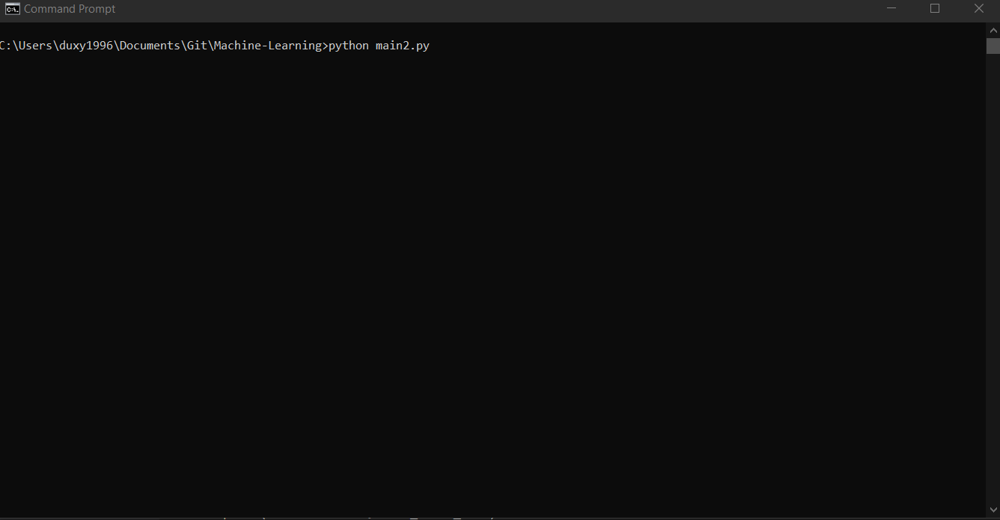

# Suicide risk prevention II (Random forest approach)
### Exercise 2 from Machine Learning for Data Analysis

## Introduction

In the past week we tried to improve the suicide risk detection using a decision tree. The article could be found in this git
repository here: [Suicide risk prevention I](https://github.com/Duxy1996/ML-modules/tree/master/W1). The results given were optimistic,
we could know in which city/zone it is probably to have the suicide problem. The accuracy of the classifier was **90%** for the test
data.

The parameters used to found this result where: **income, emplyment rate and alcohol consumption**.

## Problem:
The suicide rate is raising in many countries which the problem seemed to be controlled. The main factors of this case are not
well known yet, and this fact is dangerous because we cannot do anything without knowing the problem.

In countries such us United Kindom and EEUU suicides are rising and, now the average is over the 15 people over 100.000 people which
is worrying.

We want to use decision trees to predict in which zones this rate can raise. Using the **GapMinder** dataset we will discover which
zones are over the 15 per 100.000 of suicide rate. Knowing this information wee could make a first approach to the problem and help the
people which is in the risk group.

## Dataset:
**GapMinder** is a good reference to get data from several countries and make a study to detect people which is in the suicide risk group and help with its problems before one fatality could appear. This dataset has information about different features and targets
which are used to measure the prosperity of one country.

The features in this dataset are:

* 0 country
* 1 incomeperperson
* 2 alcconsumption
* 3 armedforcesrate
* 4 breastcancerper100th
* 5 co2emissions
* 6 femaleemployrate
* 7 hivrate
* 8 internetuserate
* 9 lifeexpectancy
* 10 oilperperson
* 11 polityscore
* 12 relectricperperson
* 13 suicideper100th
* 14 employrate
* 15 urbanrate
* 16 alcconsumption5 **This column has been added to do tests**
* 17 suicideDanger **This colum has been aded to do the final report**

As a Software Engineer, I do not have a specific formation in this field. My report is only a test for the Data Analysis group
and is a fast approach of this real problem. Should be not taken as a research paper or report.

## Code:
The code developed is used for detecting patterns without having specific knowledge of the problem. It could be used to get a first approach to the main problem.

The code developed is a simple application console which uses sklearn and pandas tools to read an create the classification 
random forest. We have added a simple for loop which is used to select the features that you want to evaluate and the impact of the
depth of the tree, a basic implementation to get the number of estimators you want to use to create your tree, a function which iterates 0 from the number given of estimators which makes a simple graphic to show the test/train scores to know if the model is
overfitted.

At the end the application show the features with its impact scores sorted to know which one is important and which one is not.

It shows the best socre of all the iterations too.

### Implementation

### Usage demo

## Problem analysis

## Conclusions:

### Classification conclusions:

## References:

[Zip python doc](https://docs.python.org/3.3/library/functions.html#zip)

[MathPlotlib python doc](https://matplotlib.org/tutorials/introductory/pyplot.html#sphx-glr-tutorials-introductory-pyplot-py)

[DecisionTreeClassifier](https://scikit-learn.org/stable/modules/generated/sklearn.tree.DecisionTreeClassifier.html)

[American Psychological Association](https://www.apa.org/monitor/2019/03/trends-suicide)

[Live Science web](https://www.livescience.com/62781-why-are-suicide-rates-rising.html)

[Desition trees](http://www.learnbymarketing.com/481/decision-tree-flavors-gini-info-gain/)

