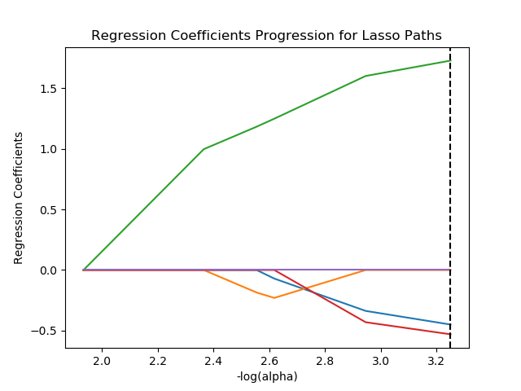
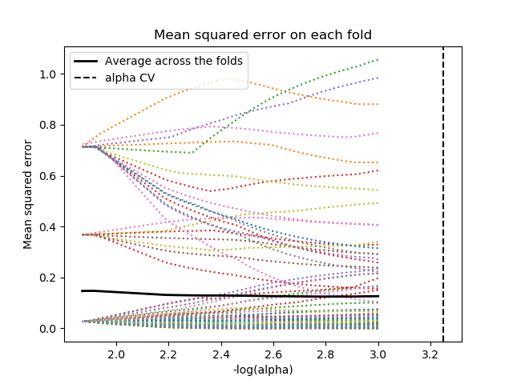

# Suicide risk prevention III (Lasso Regresion)
### Exercise 3 from Machine Learning for Data Analysis

## Introduction

In the past week we tried to improve the suicide risk detection using a decision tree. The article could be found in this git
repository here: [Suicide risk prevention I](https://github.com/Duxy1996/ML-modules/tree/master/W1). The results given were optimistic,
we could know in which city/zone it is probably to have the suicide problem. The accuracy of the classifier was **92%** for the test
data.

The parameters used to found this result where: **income, emplyment rate and alcohol consumption**. In this week we are going to analyse the main factors of this problem using the Lasso regresion method to know which parameters are the most significative. Then we will compare the results with the **Random forest most important values for classification**.

## Problem:
The suicide rate is raising in many countries which the problem seemed to be controlled. The main factors of this case are not
well known yet, and this fact is dangerous because we cannot do anything without knowing the problem.

In countries such us United Kindom and EEUU suicides are rising and, now the average is over the 15 people over 100.000 people which
is worrying.

We want to use decision trees to predict in which zones this rate can raise. Using the **GapMinder** dataset we will discover which
zones are over the 15 per 100.000 of suicide rate. Knowing this information wee could make a first approach to the problem and help the
people which is in the risk group.

## Dataset:
**GapMinder** is a good reference to get data from several countries and make a study to detect people which is in the suicide risk group and help with its problems before one fatality could appear. This dataset has information about different features and targets
which are used to measure the prosperity of one country.

The features in this dataset are:

* 0 country
* 1 incomeperperson
* 2 alcconsumption
* 3 armedforcesrate
* 4 breastcancerper100th
* 5 co2emissions
* 6 femaleemployrate
* 7 hivrate
* 8 internetuserate
* 9 lifeexpectancy
* 10 oilperperson
* 11 polityscore
* 12 relectricperperson
* 13 suicideper100th
* 14 employrate
* 15 urbanrate
* 16 alcconsumption5 **This column has been added to do tests**
* 17 suicideDanger **This colum has been aded to do the final report**

As a Software Engineer, I do not have a specific formation in this field. My report is only a test for the Data Analysis group
and is a fast approach of this real problem. Should be not taken as a research paper or report.

## Code:
The code developed is used for detecting patterns without having specific knowledge of the problem. It could be used to get a first approach to the main problem.

The code developed is a simple application console which uses sklearn and pandas tools to read an create the classification 
**Lasso regression**. We have added a simple tools to generate the graphics as we have learned in the **Week 3**. We have used the
created in **Week two** to obtain more results and compare it with this week.

> You can try the code at your own!.

### Implementation

Import needed libs
```python
import pandas as pd
import numpy as np

import matplotlib.pylab as plt
from sklearn.model_selection import train_test_split
from sklearn.linear_model import LassoLarsCV
from sklearn import preprocessing
from sklearn.metrics import mean_squared_error
```

Read corpus
```python
corpus = pd.read_csv('corpus.csv')
```

Select, clean and normalice the features
```python
predictors = corpus[['incomeperperson','employrate','suicideper100th','alcconsumption','femaleemployrate','lifeexpectancy','co2emissions']]

predictors.replace(' ', np.nan, inplace=True)
predictors = predictors.dropna()

predictors['suicideper100th']  = preprocessing.scale(predictors['suicideper100th'].astype('float64'))
predictors['incomeperperson']  = preprocessing.scale(predictors['incomeperperson'].astype('float64'))
predictors['employrate']       = preprocessing.scale(predictors['employrate'].astype('float64'))
predictors['alcconsumption']   = preprocessing.scale(predictors['alcconsumption'].astype('float64'))
predictors['femaleemployrate'] = preprocessing.scale(predictors['femaleemployrate'].astype('float64'))
predictors['lifeexpectancy']   = preprocessing.scale(predictors['lifeexpectancy'].astype('float64'))
predictors['co2emissions']     = preprocessing.scale(predictors['co2emissions'].astype('float64'))
```

Model creation and test training
```python
target     = predictors[['suicideper100th']]
predictors = predictors[['incomeperperson','employrate','alcconsumption','femaleemployrate','lifeexpectancy']]

pred_train, pred_test, tar_train, tar_test = train_test_split(predictors, target, test_size=.15, random_state = 0)

model=LassoLarsCV(cv=100, precompute=False).fit(pred_train, tar_train.values.ravel())
```

The source could could be found [here](https://github.com/Duxy1996/ML-modules/blob/master/W3/main.py) and executed when you download all the dependencies.

### Usage demo


## Problem analysis

The code allows us to configure many parameters of the **Lasso regresion** classifier used to
know if a group of people is under the risk path. Using the features of several zones and countries in the world
we can know which zones and which groups of people are in danger.

In this week we are focus on knowing which features are the most important and we will compare the results with the 
given ones got in the **Week 2**.

## 5 Predictors, Cross validation = 100 and test = 20%

### Predictos

According with the **Week 2** results the importance of this values is:

* 'incomeperperson' ->  **2º**, 10% of total score
* 'employment_rate' ->       **4º**, 7% of total score
* 'alc_consumption' ->   **1º**, 13% of total score
* 'femalemployrate' -> **5º**, 3% of total score
* 'life__expectancy' ->   **3º**, 8% of total score

> Other values were not shown because there were not relevant.

After executing the application created the results given were the followin ones:



The lines shown which parameters are the most importants to make the prediction. Each color represents one feature:

* Incomeperperson **Red** When it rises the risk is low
* Employment_rate **Purple** It is not relevant
* Alc_consumption **Green** When it rises the risk too
* Femalemployrate **Blue** When it rises the risk is low
* Life__expectancy **Purple** It is not relevant



These are the results for the mean square errors for each feature. **CV = 100**

## Lasso linear regression weights and scores

* 'incomeperperson': -0.03761833425637321,
* 'employment_rate': 0.0,
* 'alc_consumption': 0.1468110947384223,
* 'femaleemployrate': -0.04666234681934992,
* 'life__expectancy': 0.0

```
Training data MSE  0.11268062241374821
Test data MSE  0.08250593804429758
Training data R-square  16.900287393752535
Test data R-square  -8.007773439807764 
```

## Random forest VS Lasso regression

|Features|Lasso regression|Random forest|
|---|---|---|
|incomeperperson| 3º, -0.03 | **2º**, 10% |
|employment_rate| 4º, 0.00 | **4º**, 7% |
|alc_consumption| 1º, 0.14 | **1º**, 13% |
|femaleemployrate| 2º, -0.04 | **5º**, 3% |
|life__expectancy| 4º, 0.00 | **3º**, 8% |

Depending of which classificator each feature has one weight. Using bouth we can generalice and have better results.

## Conclusions:

As we can see in the several iterations above that **alcohol consumption** , **employment rate**, **money income** and **urbanrate**
have a direct impact in the suicide rate in one country/zone. This factos are related with the people happines and it seems
normal the results given.

### Week one
* When there is a high level of alcohol consumption the risk of suicide is high too.
* When the employment rate is high, the suicide risk is low.
* When the employment rate is high, but the alocohol consumption too the suicide risk is high
* When the income is high, the suicide risk drops

### Week two
* The emplyment rate is not such important
* The urban rate is more important than **employment rate** and **money income**
* We cannot discard any features which affect to this risk despite of **oilperperson**

### Week three


## References:

[Zip python doc](https://docs.python.org/3.3/library/functions.html#zip)

[MathPlotlib python doc](https://matplotlib.org/tutorials/introductory/pyplot.html#sphx-glr-tutorials-introductory-pyplot-py)

[DecisionTreeClassifier](https://scikit-learn.org/stable/modules/generated/sklearn.tree.DecisionTreeClassifier.html)

[Lasso Regression](https://scikit-learn.org/stable/modules/generated/sklearn.linear_model.LassoCV.html)

[Lasso Regression features](https://github.com/scikit-learn/scikit-learn/issues/6251)

[American Psychological Association](https://www.apa.org/monitor/2019/03/trends-suicide)

[Live Science web](https://www.livescience.com/62781-why-are-suicide-rates-rising.html)

[Desition trees](http://www.learnbymarketing.com/481/decision-tree-flavors-gini-info-gain/)